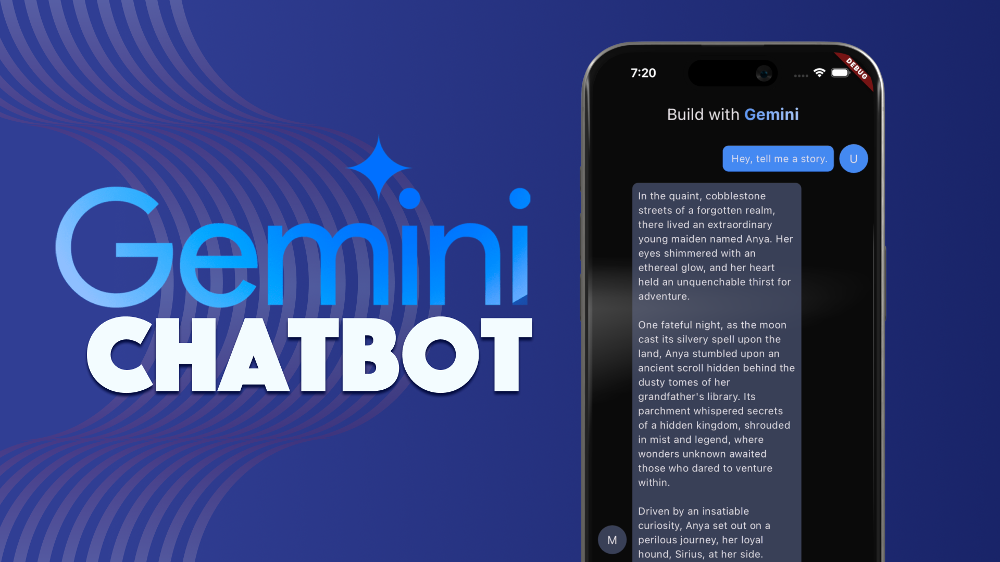

# Realtime Multiturn Chatbot with Flutter & Gemini
The project aims to create a simple AI chatbot that utilizes the Dart package `google_generative_ai` and the Gemini AI model. Using dart_frog as a backend server, the project establishes a WebSocket connection between the client and the server to build a real-time, multi-turn AI chatbot. 

### Video tutorial: https://youtu.be/_yg1KHNv_tE

 
